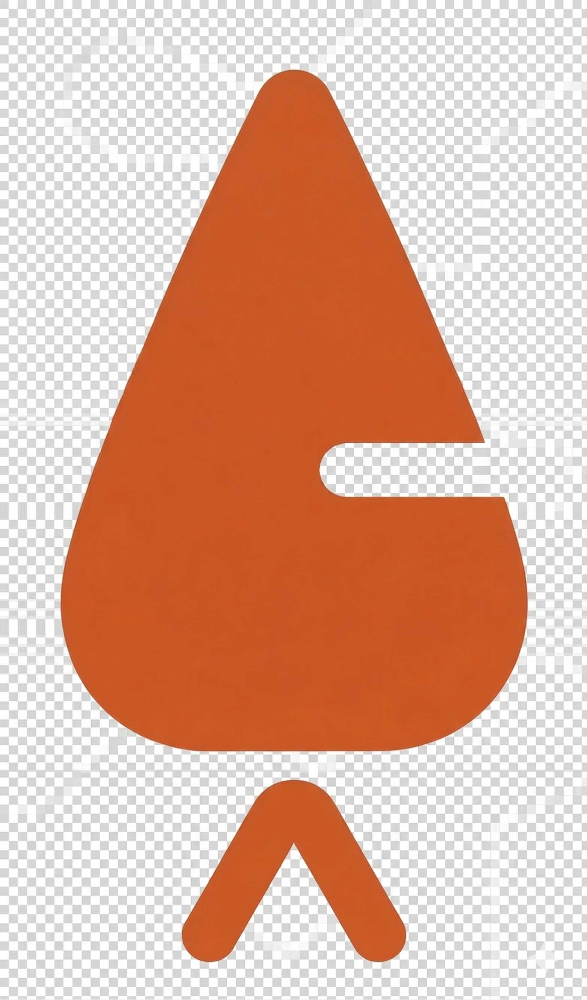
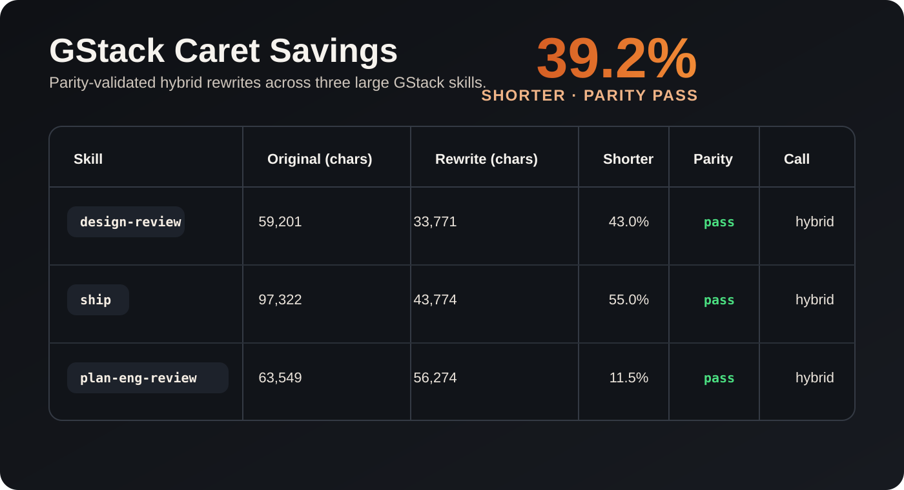

  

# Caret^

**Caret^ cuts repeated agent instructions down to compact notation.**  

Across our sample set, prompt length was reduced by 95.8% by rewriting agent skill and persona files using Caret notation.

This is for you if you ever draft or use Markdown files as agent skills or personas. If you design harnesses, it is a no brainer. 

## Before

    Use a reviewer mindset. Be very skeptical, much more than you usually are. Go deeper than normal. If this needs a separate pass, hand it to a researcher. Verify key claims. Treat the next section as a clean restart.

## After

    ^^reviewer ^skeptical8 ^depth8
    ^^^researcher
    ^verification8
    ^^^^

## Benefits

**Lower cost**
* Less tokens used. By a lot.
* Less API tokens crushed by experiments.
* Less of your time saying the same thing over and over. 

**Better results**
* More deterministic and consistent. Period.
* Less context anxiety from overfilled context windows
* Write faster with more expressive control and confidence

**This is not just about saving tokens for the sake of saving tokens.**

Less prompt bulk means less money burned on repetition, less drag on performance, and less time spent retyping the same workflow moves in full sentences. It also gives you something normal writing does badly with agents: a compact way to express intensity, structure, and operational intent without writing a paragraph every time.

In speech, you have volume and tone. In normal prompting, you mostly have sprawl.  

**Caret^ gives you a shorthand for precision.**

Most prompt bloat comes from something obvious:
people keep restating recurring workflow instructions in full sentences.

Use this mindset.  
Go deeper.  
Be more skeptical.  
Verify the claims.  
Hand this off.  
Reset context.

Useful? Yes.  
Efficient? Not even slightly.

**Caret^ replaces repetition with compact markers.**

## Where the 95.8% came from

We sampled both our own material and random skills from Garry Tan’s GStack, then compared the original versions to Caret-style rewrites.

**Average reduction across the sample: 95.8%.**

## Start fast

1. Read `caret-cheatsheet.md`.
2. Copy-paste it into your system or load it into your harness so your agent always sees it.
3. Load the `caret-it-skill.md` alongside any skill from your library.
4. Your agent can immediately rewrite it in Caret^ and tell you how many tokens you save.

That is the point: it works immediately.

From there, you can customize local commands, add your own patterns, and shape it to your workflow.  
But you do not need to do any of that to start getting the benefit.

## Caret^

Caret^ is a semantic signal layer for agent workflows in Markdown. It gives you a compact way to signal pressure, scope, stance, separation, and operating intent without dragging a giant prompt framework behind it.

It does not tell the system how to work. It tells the system what kind of work you want.

## Start Here

If you are new, use `/onboard-to-caret.md`.

If you only need the product, use `/caret-cheatsheet.md`.

If you want the recommended platform install, use `/platform/caret-core-starter.md`.

If you need the canon behind it, read `/notation/`.

If you want the philosophy behind it, read `/MANIFESTO.md`.

If you want the case for using it, read `/why-to-use-caret.md`.

If you want to compress an existing skill or instruction-heavy Markdown file into Caret^, use `/Caret-it-skill.md`.

If you expect to use Caret^ repeatedly, promote it to a platform-level skill or instruction layer instead of pasting it into one chat at a time.

If you need platform-specific starter variants for that installation, use `/platform/README.md`.

Read order:

1. `/caret-cheatsheet.md`
2. `/notation/README.md`
3. `/notation/SPEC.md`
4. `/notation/SEMANTICS.md`
5. `/notation/INTERPRETATION.md`
6. `/notation/SECURITY.md`
7. `/notation/DECISIONS.md`

## What This Repo Is

This repo is built around one rule: the cheatsheet comes first.

Everything else exists to support that portable artifact:

- `notation/` is canon
- `glossary/` defines terms around the canon
- `examples/` shows the canon in motion
- `patterns/` shows reusable workflow shapes
- `research/` supports decisions without becoming the source of truth
- `governance/` records how changes get made

The split matters:

- research holds evidence
- governance holds the rules that evidence must pass through before canon or core workflow assets change

The order matters. The cheatsheet leads. Canon follows. Everything else is downstream.

This repo is also supreme over surrounding material.

- archives do not outrank it
- drafts do not outrank it
- external repos do not outrank it
- examples, patterns, and research do not outrank canon

Outside material can inform the repo. It does not overrule the repo.

## Design Stance

Caret^ keeps the structure tight and the vocabulary open.

- fixed core forms
- open directive vocabulary
- Markdown-native scope
- harness-defined execution
- explicit trust boundaries

The ambition is not to become a language. The ambition is to stay small, sharp, and useful.

## Change Discipline

If `/caret-cheatsheet.md` changes, every notation-bearing file in the repo gets reviewed.

No silent drift.
No stale examples.
No patterns teaching yesterday's meaning.

## Current State

The core is live.

The cheatsheet is the product.
The canon is in place.
The supporting surfaces exist to keep the product sharp, teachable, and durable.

## Support

If Caret^ saves you time or helps your workflow, you can support the project at `disruptionjoe.eth`.

## Contributing

Issues are welcome now.

Pull requests may come later once the canon and repo shape settle a bit more.

For now, the best contribution is:

- report ambiguity
- flag stale examples
- point out harness edge cases
- surface public-readiness gaps
